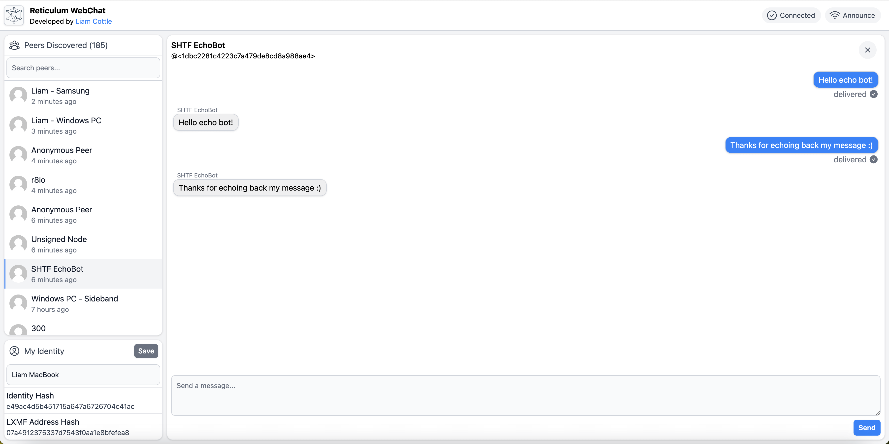

<p align="center">
<a href="https://github.com/liamcottle/reticulum-meshchat"></a>
</p>

<h2 align="center">Reticulum MeshChat</h2>

<p align="center">
<a href="https://discord.gg/APQSQZNV7t"></a>
<a href="https://twitter.com/liamcottle"></a>
<br/>
<a href="https://ko-fi.com/liamcottle"></a>
<a href="./donate.md"></a>
</p>

## What is Reticulum MeshChat?

A simple mesh network communications app powered by the [Reticulum Network Stack](https://github.com/markqvist/Reticulum).



## What does it do?

- It can send and receive messages, files and audio calls with peers;
    - Over your local network through Ethernet and WiFi, completely automatically.
    - Over the internet by connecting through a server hosted by yourself or the community.
    - Over low-powered, license-free, ISM band LoRa Radio, with an [RNode](https://github.com/markqvist/RNode_Firmware).
    - ...and via any other interface supported by the Reticulum Network Stack.
- It communicates securely. Messages can only be decrypted by the intended destination.
- It can communicate with any other existing [LXMF](https://github.com/markqvist/lxmf) client, such as [Sideband](https://github.com/markqvist/Sideband/) and [Nomadnet](https://github.com/markqvist/nomadnet).
- It can download files and browse micron pages (decentralised websites) hosted on [Nomad Network](https://github.com/markqvist/nomadnet) nodes.

## Features

- Supports sending and receiving messages between [Reticulum MeshChat](https://github.com/liamcottle/reticulum-meshchat), [Sideband](https://github.com/markqvist/Sideband/) and [Nomadnet](https://github.com/markqvist/nomadnet).
- Supports receiving and saving images and attachments sent from Sideband.
- Supports sending images, voice recordings and file attachments.
- Supports saving inbound and outbound messages to a local database.
- Supports sending an announce to the network.
- Supports setting a custom display name to send in your announce.
- Supports viewing and searching peers discovered from announces.
- Supports auto resending undelivered messages when an announce is received from the recipient.

## Beta Features

- Support for Audio Calls to other [Reticulum MeshChat](https://github.com/liamcottle/reticulum-meshchat) users.
  - Audio is encoded with [codec2](https://github.com/drowe67/codec2) to support low bandwidth links.
  - Using a microphone requires using the web ui over localhost or https, due to [AudioWorklet](https://developer.mozilla.org/en-US/docs/Web/API/AudioWorklet) secure context.
  - I have tested two-way audio calls over LoRa with a single hop. It works well when a [reasonable bitrate](https://unsigned.io/understanding-lora-parameters/) is configured on the RNode.
  - Some browsers such as FireFox don't work as expected. Try using a Chromium based browser if running via the command line.
- Support for browsing pages, and downloading files hosted on Nomad Network Nodes.

> NOTE: micron format parsing is still in development, some pages may not render or work correctly at all.

## Download

You can download the latest version for Windows, Mac and Linux from the [releases](https://github.com/liamcottle/reticulum-meshchat/releases) page.

Alternatively, you can download the source and run it manually from a command line.

See the ["How to use it?"](#how-to-use-it) section below on how to do this.

## Getting Started

Once you've downloaded, installed and launched Reticulum MeshChat, there's a few things you need to do in order to start communicating with other people on the network.

1. Create an Identity
2. Configure your Display Name
3. Send an Announce
4. Discover Peers and start sending messages
5. Configuring additional Network Interfaces

**Create an Identity**

On the Reticulum Network, anyone can have any number of Identities. You may opt to use your real name, or you may decide to be completely anonymous. The choice is yours.

A Reticulum Identity is a public/private key-pair. You control the private key used to generate destination addresses, encrypt content and prove receipt of data with unforgeable delivery acknowledgements.

Your public key is shared with the network when you send an announce, and allows others on the network to automatically discover a route to a destination you control.

At this time, Reticulum MeshChat generates a new Identity the first time you launch it. A future update will allow you to create and manage multiple identities.

For now, if you want to change, or reset your identity, you can access the identity file at `~/.reticulum-meshchat/identity`.

**Configure your Display Name**

The next thing you should do, is set a display name. Your display name is what everyone else on the network will see when looking for someone to communicate with from the Peers list.

You can do this in the `My Identity` section in the bottom left corner. Enter a new display name, and then press `Save`.

**Send an Announce**

When using the Reticulum Network, in order to be contactable, you need to send an `Announce`. You can send an announce as often, or as infrequently as you like.

Sending an announce allows other peers on the network to discover the next-hop across the network their packets should take to arrive at a destination that your identity controls.

If you never send an announce, you will be invisible and no one will ever be able to send anything to you.

When you move across the network, and change entrypoints, such as moving from your home WiFi network, to plugging in to an Ethernet port in a local library or even climbing a mountain and using an RNode over LoRa radio, other peers on the network will only know the previous path to your destinations.

To allow them to discover the new path their packets should take to reach you, you should send an announce.

**Discover Peers and start sending messages**

In the Reticulum Network, you can control an unlimited number of destination addresses. One of these can be an [LXMF](https://github.com/markqvist/lxmf) delivery address.

Your Reticulum Identity allows you to have an LXMF address. Think of an LXMF address as your very own, secure, end-to-end encrypted, unspoofable, email address routed over a mesh network.

When someone else on the network announces themselves (more specifically, their LXMF address), they will show up in the Peers tab.

You can click on any of these discovered peers to open a messaging interface. From here, you can send text messages, files and inline images. If they respond, their messages will show up there too.

As well as being able to announce your LXMF address and discover others, Reticulum MeshChat can also discover [Nomad Network](https://github.com/markqvist/nomadnet) nodes hosted by other users. From the Nodes tab, you are free to explore pages and download files they may be publicly sharing on the network.

A future update is planned to allow you to host your own Node and share pages and files with other peers on the network. For now, you could use the official [Nomad Network](https://github.com/markqvist/nomadnet) client to do this.

Remember, in order to connect with other peers or nodes, they must announce on the network. So don't forget to announce if you want to be discovered!

**Configuring additional Network Interfaces**

> TODO: this section is yet to be written. For now, you can check out the [official documentation for configuring interfaces](https://reticulum.network/manual/interfaces.html) in the Reticulum config file. This file is located at `~/.reticulum/config`

## How does it work?

- A python script ([meshchat.py](./meshchat.py)) runs a Reticulum instance and a WebSocket server.
- The web page sends and receives LXMF packets encoded in json via the WebSocket.
- Web Browser -> WebSocket -> Python Reticulum -> (configured interfaces) -> (destination)
- LXMF messages sent and received are saved to a local SQLite database.

## How to use it?

It is recommended that you [download](#download) a standalone application.

If you don't want to, or a release is unavailable for your device, you will need to;

- install [Python 3](https://www.python.org/downloads/)
- install [NodeJS v18+](https://nodejs.org/en)
- clone the source code from this repo
- install all dependencies
- then run `meshchat.py`.

```
# clone repo
git clone https://github.com/liamcottle/reticulum-meshchat
cd reticulum-meshchat

# install nodejs deps
# if you want to build electron binaries, remove "--omit=dev"
# if you're using termux, add "--ignore-scripts" to fix error with esbuild
npm install --omit=dev

# build frontend vue components
npm run build-frontend

# install python deps
pip install -r requirements.txt

# run meshchat
python meshchat.py
```

> NOTE: You should now be able to access the web interface at http://localhost:8000

For a full list of command line options, you can run;

```
python meshchat.py --help
```

```
usage: meshchat.py [-h] [--host [HOST]] [--port [PORT]] [--headless] [--identity-file IDENTITY_FILE] [--identity-base64 IDENTITY_BASE64] [--generate-identity-file GENERATE_IDENTITY_FILE] [--generate-identity-base64]
              [--reticulum-config-dir RETICULUM_CONFIG_DIR] [--storage-dir STORAGE_DIR]

ReticulumMeshChat

options:
  -h, --help            show this help message and exit
  --host [HOST]         The address the web server should listen on.
  --port [PORT]         The port the web server should listen on.
  --headless            Web browser will not automatically launch when this flag is passed.
  --identity-file IDENTITY_FILE
                        Path to a Reticulum Identity file to use as your LXMF address.
  --identity-base64 IDENTITY_BASE64
                        A base64 encoded Reticulum Identity to use as your LXMF address.
  --generate-identity-file GENERATE_IDENTITY_FILE
                        Generates and saves a new Reticulum Identity to the provided file path and then exits.
  --generate-identity-base64
                        Outputs a randomly generated Reticulum Identity as base64 and then exits.
  --reticulum-config-dir RETICULUM_CONFIG_DIR
                        Path to a Reticulum config directory for the RNS stack to use (e.g: ~/.reticulum)
  --storage-dir STORAGE_DIR
                        Path to a directory for storing databases and config files (default: ./storage)
```

## Running on Android

It is possible to run on Android from source, using Termux. You will need to install a few extra dependencies and make a change to `requirements.txt`.

```
pkg upgrade
pkg install git
pkg install nodejs-lts
pkg install python-pip
pkg install rust
pkg install binutils
pkg install build-essential
```

You should now be able to follow the [how to use it](#how-to-use-it) instructions above.

Before running `pip install -r requirements.txt`, you will need to comment out the `cx_freeze` dependency. It failed to build on my Android tablet, and is not actually required for running from source.

```
nano requirements.txt
```

Ensure the `cx_freeze` line is updated to `#cx_freeze`

> Note: Building wheel for cryptography may take a while on Android.

Once MeshChat is running via Termux, open your favourite Android web browser, and navigate to http://localhost:8000

> Note: The default `AutoInterface` may not work on your Android device. You will need to configure another interface such as `TCPClientInterface`.

## Using an existing Reticulum Identity

The first time you run this application, a new Reticulum identity is generated and saved to `storage/identity`.

If you want to use an existing identity;

- You can overwrite `storage/identity` with another identity file.
- Or, you can pass in a custom identity file path as a command line argument.

To use a custom identity file, provide the `--identity-file` argument followed by the path to your custom identity file.

```
python meshchat.py --identity-file ./custom_identity_file
```

If you would like to generate a new identity, you can use the [rnid](https://reticulum.network/manual/using.html#the-rnid-utility) utility provided by Reticulum.

```
rnid --generate ./new_identity_file
```

If you don't have access to the `rnid` command, you can use the following:

```
python meshchat.py --generate-identity-file ./new_identity_file
```

Alternatively, you can provide a base64 encoded private key, like so;

```
python meshchat.py --identity-base64 "GCN6mMhVemdNIK/fw97C1zvU17qjQPFTXRBotVckeGmoOwQIF8VOjXwNNem3CUOJZCQQpJuc/4U94VSsC39Phw=="
```

> NOTE: this is a randomly generated identity for example purposes. Do not use it, it has been leaked!

## Build Electron Application

Reticulum MeshChat can be run from source via a command line, as explained above, or as a standalone application.

To run as a standalone application, we need to compile the python script and dependencies to an executable with [cxfreeze](https://github.com/marcelotduarte/cx_Freeze) and then build an [Electron](https://www.electronjs.org/) app which includes a bundled browser that can interact with the compiled python executable.

This allows for the entire application to be run by double clicking a single file without the need for a user to manually install python, nor run any commands in a command line application.

To build a `.exe` when running on Windows or a `.dmg` when running on a Mac, run the following;

```
pip install -r requirements.txt
npm install
npm run dist
```

> Note: cxfreeze only supports building an executable for the current platform. You will need a Mac to build for Mac, and a Windows PC to build for Windows.

Once completed, you should have a `.exe` or a `.dmg` in the `dist` folder.

## Local Development

I normally run the following commands to work on the project locally.

**Install dependencies**

```
pip install -r requirements.txt
npm install
```

**Build and run Electron App**

```
npm run electron
```


**or; Build and run MeshChat Server**

```
npm run build-frontend
python3 meshchat.py --headless
```

I build the vite app everytime without hot reload, since MeshChat expects everything over its own port, not the vite server port. I will attempt to fix this in the future.

## TODO

- [ ] button to forget announces
- [ ] optimise ui to work nicely on a mobile device, such as Android/iOS
  - [ ] will probably write a new app for mobile devices once [microReticulum](https://github.com/attermann/microReticulum) supports Links
- [ ] support for micron input fields, to allow interacting with pages like Retipedia
- [ ] support for managing Reticulum interfaces via the web ui
  - [x] AutoInterface
  - [x] RNodeInterface
  - [x] TCPClientInterface
  - [x] TCPServerInterface
  - [x] UDPInterface
  - [ ] I2PInterface
  - [ ] SerialInterface
  - [ ] PipeInterface
  - [ ] KISSInterface
  - [ ] AX25KISSInterface
  - [ ] Other Options
    - [ ] network_name
    - [ ] passphrase

# Notes

**LXMF Router**

- By default, the LXMF router rejects inbound messages larger than 1mb.
- LXMF clients are likely to have [this default limit](https://github.com/markqvist/LXMF/blob/master/LXMF/LXMRouter.py#L35), and your messages will [fail to send](https://github.com/markqvist/LXMF/blob/master/LXMF/LXMRouter.py#L1026).
- MeshChat has increased the receive limit to 10mb to allow for larger attachments.

## License

MIT
